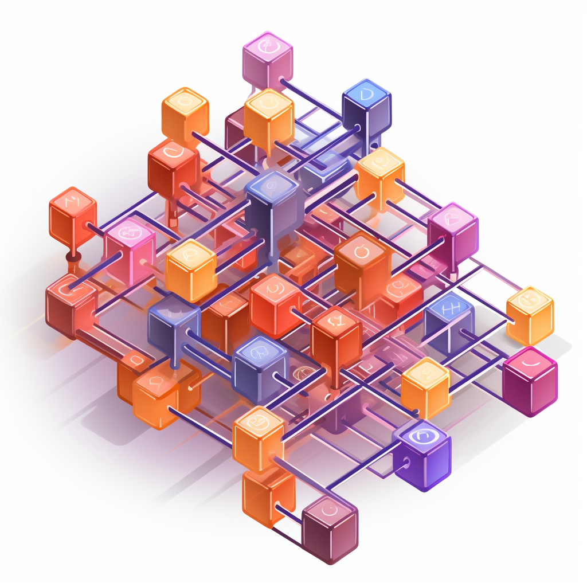

# PyDataAlgo
Welcome to PyDataAlgo, a comprehensive guide designed to illuminate the intricacies of data structures and algorithms in Python. Whether you're a student, software engineer, or data scientist, this resource aims to bolster your understanding of the foundational elements that are crucial in writing efficient and effective code. Dive into an exploration of primitive and complex data structures, unpack common and advanced algorithmic strategies, and master the concepts that underpin computational problem-solving.

## Table of Contents

- [PyDataAlgo](#pydataalgo)
  * [Section 1: Understanding Data Structures in Python](#section-1-understanding-data-structures-in-python)
  * [Section 2: Algorithm Types and Their Uses in Python](#section-2-algorithm-types-and-their-uses-in-python)
  * [Section 3: Unlock the Power of Recursion in Python](#section-3-unlock-the-power-of-recursion-in-python)
  * [Section 4: Unlock the Power of Iterative Solution in Python](#section-4-unlock-the-power-of-iterative-solution-in-python)
  * [Section 5: Unlocking the Secrets of Algorithm Efficiency](#section-5-unlocking-the-secrets-of-algorithm-efficiency)
  * [Section 6: Space and Time Complexity](#section-6-space-and-time-complexity)
  * [Section 7: Exploring Arrays in Python: Part 1](#section-7-exploring-arrays-in-python-part-1)
  * [Section 8: Exploring Arrays in Python: Part 2](#section-8-exploring-arrays-in-python-part-2)
  * [Section 9: Explore the dynamic nature of lists](#section-9-explore-the-dynamic-nature-of-lists)
  * [Section 10: Mastering Python Dictionaries](#section-10-mastering-python-dictionaries)
  * [Section 11: Delving into Python Tuples](#section-11-delving-into-python-tuples)
  * [Section 12: Understanding Python Linked Lists](#section-12-understanding-python-linked-lists)
  * [Section 13: Dive into Singly Linked Lists](#section-13-dive-into-singly-linked-lists)  


Section 10: Mastering Python Dictionaries

## Section 1: Understanding Data Structures in Python


Data structures are fundamental components in Python programming. They allow you to organize and manage data efficiently. In Python, we have two main categories of data structures: primitive and non-primitive.

#### Primitive Data Structures:
These are the basic building blocks that store single values:

- **int:** Stores whole numbers, positive or negative, like ages or counts.
- **float:** Represents floating-point numbers with decimal places, useful for measurements and calculations.
- **bool:** Stores binary data, either True or False, often used in decision-making.
- **str:** Represents strings of characters, such as names, addresses, or textual information.

#### Non-Primitive Data Structures:
These are more complex and can store collections of data. They are further categorized into two types: linear and non-linear.

#### Linear:
Linear data structures organize data sequentially, where each element has a unique predecessor and successor. They can be further divided into two subtypes: static and dynamic.

#### Static:
Static structures have a fixed size that cannot change during runtime. An example of a static structure is an array.

- **Arrays:** Store elements of the same data type sequentially in memory.

#### Dynamic:
Dynamic structures can grow or shrink during runtime. Examples include linked lists, stacks, and queues.

- **Linked Lists:** Consist of nodes that contain data and a reference (or link) to the next node.
- **Stacks:** Follow a Last-In-First-Out (LIFO) order and are often used for tasks like function call management.
- **Queues:** Follow a First-In-First-Out (FIFO) order, ideal for tasks like task scheduling.

#### Non-Linear:
Non-linear data structures do not follow a strict order and can have multiple predecessors or successors. Examples include trees and graphs.

- **Trees:** Consist of nodes with parent-child relationships. They are used in hierarchical structures.
- **Graphs:** Consist of nodes (vertices) and edges that connect them, allowing complex relationships.

## Section 2: Algorithm Types and Their Uses in Python


Algorithms are essentially step-by-step procedures or instructions used to solve specific problems. In Python, they play a crucial role in efficient problem-solving and are widely utilized in various domains, including data analysis, machine learning, and software development.

Let's take a closer look at some common types of algorithms:

#### Simple Recursive:
This type of algorithm breaks down a problem into smaller subproblems of a similar nature. By solving these subproblems recursively, we can eventually arrive at a solution for the main problem. It's a powerful technique that allows us to solve complex problems by dividing them into more manageable chunks.

#### Divide and Conquer:
Similar to the simple recursive approach, the divide and conquer algorithm also involves breaking down a problem into smaller subproblems. However, it differs in that it combines the solutions to these subproblems to obtain the final solution for the main problem. It's particularly useful for solving problems that can be divided into independent parts.

Two popular examples of the divide and conquer algorithm are Quick Sort and Merge Sort.

#### Dynamic Programming:
Dynamic programming algorithms rely on a technique called memorization. This means that they store the results of subproblems to avoid redundant computations. By utilizing this approach, dynamic programming algorithms solve complex problems more efficiently by breaking them down into overlapping subproblems.

#### Greedy Algorithm:
Greedy algorithms aim to find the best possible solution at each step without considering the overall consequences. They are particularly useful for optimization problems where the goal is to maximize or minimize a certain objective. Greedy algorithms are often employed in scenarios where finding the globally optimal solution is not necessary.

#### Brute Force:
Brute force algorithms involve exhaustively checking all possible solutions to a problem. Although they may not be the most efficient, brute-force algorithms guarantee to find the correct solution. They are commonly used when the problem size is small or when other more efficient algorithms are not available.

#### Randomized Algorithms:
Randomized algorithms introduce an element of randomness into the problem-solving process. They utilize random inputs or decisions to solve problems. These algorithms are often used in scenarios where the input is uncertain or where randomness can lead to more efficient solutions.

## Section 3: Unlock the Power of Recursion in Python


### What is Recursion?

Recursion is a programming technique where a function calls itself to solve a problem. It's like a problem-solving approach where a larger problem is broken down into smaller, similar subproblems.

Imagine Russian nesting dolls, also known as Matryoshka dolls, where each doll contains a smaller doll inside. The process of opening the dolls one by one can be thought of as a recursive operation.

#### Russian Nesting dolls:


### Properties of Recursion with Russian Dolls Example:

#### Base Case:
The base case in the Russian doll example is finding the smallest doll with no more dolls inside. This is crucial in recursion to prevent an infinite loop.

#### Recursive Case:
The recursive case is the process of opening a doll to reveal a smaller one inside. This case calls the same operation (opening dolls) on a smaller version of the problem (the smaller doll).

#### Parts of the Recursive Method:
In a recursive method, you typically have three main components:

- **Base Case:** This is the condition that defines when the recursion should stop. It prevents infinite recursion by providing a terminating condition.
- **Recursive Case:** This is where the function calls itself with a modified version of the problem, making it closer to the base case. It's the part that "solves" a smaller subproblem.
- **Unintentional Case:** This is the part of the problem that doesn't fall into the base case or recursive case. You should ensure that the recursive method eventually reaches the base case to avoid infinite recursion.

#### How Recursive Method Works and Stack Memory:
When a recursive function is called, a stack is used to keep track of function calls. Each function call is placed on the stack, and when a function call returns, it is removed from the stack.

Here's a step-by-step example of a recursive function and how it's stored in the stack:

```python
def calculate_factorial(n):
    assert n >= 0 and int(n) == n, 'The number must be a positive integer only!'
    if n in [0, 1]:
        return 1
    else:
        return n * calculate_factorial(n - 1)
```


1. `factorial(5)` is called and added to the stack.
2. `factorial(4)` is called and added to the stack.
3. `factorial(3)` is called and added to the stack.
4. `factorial(2)` is called and added to the stack.
5. `factorial(1)` is called and added to the stack.
6. `factorial(0)` is called and added to the stack.

Now, the base case is reached (`n == 0`).

The calculations start to complete:

1. `factorial(0)` returns 1.
2. `factorial(1)` returns 1 * 1 = 1.
3. `factorial(2)` returns 2 * 1 = 2.
4. `factorial(3)` returns 3 * 2 = 6.
5. `factorial(4)` returns 4 * 6 = 24.
6. `factorial(5)` returns 5 * 24 = 120.

Each function call returns its result, and as it does so, it is removed from the stack.

#### When to Use Recursion:
Recursion is useful in various situations, including:

- Solving Problems with Divisibility: Recursion is often used

 to solve problems that can be divided into smaller, similar subproblems, like sorting and searching algorithms.
- Tree and Graph Structures: When working with tree or graph data structures, recursive algorithms can be more intuitive.
- Mathematical Calculations: Recursion can simplify mathematical operations, such as factorials, exponentials, and Fibonacci sequences.
- Exploring All Possibilities: Recursion can be used to explore all possible solutions or paths in a problem space, like in backtracking algorithms.

#### When to Avoid Recursion:
Recursion should be used judiciously, and there are situations when it's better to avoid it:

- Performance Concerns: Recursive calls can lead to stack overflow errors for deep recursion. In such cases, iterative solutions or tail recursion may be more suitable.
- Complexity and Debugging: Recursive code can be harder to understand and debug compared to iterative solutions. It's essential to have a clear understanding of how recursion works.
- Limited Stack Size: In some environments, there may be a limit on stack size, which can restrict the use of recursion for deep calls.

## Section 4: Unlock the Power of Iterative Solution in Python

### Iterative Solutions in Python:

In Python, an iterative solution involves solving a problem through a loop-based approach, where you repeatedly execute a set of instructions until a specific condition is met. Iteration is a fundamental concept in programming, and it's often used when you need to perform a task multiple times or when you can't easily express the problem in a recursive manner.

#### Example:
**Power of Two (Iterative and Recursive):**

Let's use the example of calculating the power of two (2^n) to illustrate both iterative and recursive solutions.

**Iterative Solution:**
```python
def power_of_two_iterative(n):
    result = 1
    for _ in range(n):
        result *= 2
    return result
```

**Recursive Solution:**
```python
def power_of_two_recursive(n):
    if n == 0:
        return 1
    else:
        return 2 * power_of_two_recursive(n - 1)
```

#### Comparison:
- The iterative solution uses a for loop to repeatedly multiply the result by 2 `n` times.
- The recursive solution uses a function that calls itself with a decreasing value of `n` until `n` reaches 0.

#### When to Use Iterative Solutions:
Iterative solutions are often preferred in the following situations:

- **Performance:** Iterative solutions can be more efficient than recursive ones in many cases, as they avoid the overhead of function calls.
- **Readability:** Iterative code can be more straightforward and easier to read for some problems, especially those that involve looping through data structures.
- **Memory Efficiency:** Iterative solutions often have lower memory consumption compared to recursive ones, as they don't create a new stack frame for each recursive call.

#### When to Avoid Iterative Solutions:
- **Complex Problems:** If a problem naturally involves doing something over and over again, like solving a puzzle piece by piece, it's usually fine to use iterative solutions. But for problems that are like a maze with lots of twists and turns, trying to solve them step by step with loops can make your code messy and hard to understand.
- **Too Many Steps:** Imagine trying to stack a thousand pieces of paper one by one. It's a lot of work, and it might be easier to find a shortcut. Similarly, if you have to do something many, many times, an iterative solution can become inefficient or even lead to errors.
- **Running Out of Space:** Think of your computer's memory like a shelf with limited space. If you keep adding books (or data) to it, it might run out of space. Iterative solutions sometimes use more memory because they remember where they left off. In such cases, a recursive approach or a different strategy may be better.


## Section 5: Unlocking the Secrets of Algorithm Efficiency

### Big O


#### Big O and Time Complexity:

Big O notation (often referred to as time complexity) is a way to describe how the runtime of an algorithm grows as the input size increases. It provides an upper bound on the runtime, helping us understand algorithm performance in the worst-case scenario.

**Example:**
Consider a car's performance, analogous to an algorithm. The time it takes for a car to travel depends on conditions like road, weather, traffic, and engine power.

- The car represents an algorithm.
- Travel time represents the algorithm's runtime.
- Road conditions, weather, and traffic are input conditions or sizes.

#### Best Case, Worst Case, and Average Case:

In algorithm analysis, we consider different scenarios:

- **Best Case:** The scenario where the algorithm performs at its best, akin to a car on an empty road with perfect conditions.
  
- **Worst Case:** The scenario where the algorithm performs at its worst, similar to a car in congested traffic and bad weather.
  
- **Average Case:** The expected runtime when considering all possible inputs or scenarios.


**Image Source:** [Algorithm Analysis](https://medium.com/@evertongomede/algorithm-analysis-aa19be7abf8)

#### Big O (O-notation), Big Omega (Ω-notation), Big Theta (Θ-notation):

- **Big O (O-notation):** Represents the upper bound or worst-case scenario for an algorithm's runtime. It guarantees that the algorithm won't run any slower than this upper limit as the input size increases.

- **Big Omega (Ω-notation):** Represents the lower bound or best-case scenario for an algorithm's runtime. It ensures that the algorithm won't run faster than this lower limit as the input size increases.

- **Big Theta (Θ-notation):** Represents a tight bound on an algorithm's runtime, providing both best and worst-case information.

**Example:**
Searching for a book in a library—worst case expressed as O(n), where 'n' is the number of shelves.

**Image Source:** [Understanding Time Complexity](https://encrypted-tbn0.gstatic.com/images?q=tbn:ANd9GcSDvwugyxsWWXV0SK0T2ZVLnWJoTVptU4ZPxw&usqp=CAU)

In summary, Big O is the worst-case scenario, Big Omega is the best-case scenario, and Big Theta is an average or tight bound, helping us understand and communicate algorithm performance under different conditions.


---

## Section 6: Space and Time Complexity
#### Algorithm Runtime Complexities:

Algorithm runtime complexity measures how an algorithm's performance behaves with increasing input size, especially for large datasets.

**Types of Runtime Complexities:**

- **O(1) - Constant Time Complexity:** Execution time remains constant regardless of input size (e.g., accessing an element by index).
```python
# O(1) - Constant Time Complexity
def access_first_element(my_list):
    # This function returns the first element of the list.
    return my_list[0]

```

- **O(c) - Constant Time Complexity:** Similar to O(1), the algorithm executes in constant time (e.g., simple arithmetic operation).

```python
# O(c) - Constant Time Complexity
def add(a, b):
    # This function adds two numbers and returns the result.
    return a + b

```

- **O(2N) - Linear Time Complexity:** Execution time grows linearly with the input size (e.g., simple loop iterating through the input list).

```python
# O(2N) - Linear Time Complexity
def linear_sum(numbers):
    # This function calculates the sum of a list of numbers using a loop.
    total = 0
    for num in numbers:
        total += num
    return total

```

- **O(N^2) - Quadratic Time Complexity:** Execution time grows with the square of the input size (e.g., nested loops comparing all pairs of elements).

```python
# O(N^2) - Quadratic Time Complexity
def bubble_sort(arr):
    # This function sorts a list using the bubble sort algorithm.
    n = len(arr)
    for i in range(n):
        for j in range(0, n - i - 1):
            if arr[j] > arr[j + 1]:
                arr[j], arr[j + 1] = arr[j + 1], arr[j]

```

- **O(log N) - Logarithmic Time Complexity:** Execution time increases logarithmically with the input size (e.g., binary search in a sorted list).

```python
# O(log N) - Logarithmic Time Complexity
def binary_search(arr, target):
    # This function performs binary search to find the target element in a sorted list.
    left, right = 0, len(arr) - 1
    while left <= right:
        mid = (left + right) // 2
        if arr[mid] == target:
            return mid
        elif arr[mid] < target:
            left = mid + 1
        else:
            right = mid - 1
    return -1

```
# 


**Image Source:** [Time Complexities Cheat Sheet](https://www.hackerearth.com/practice/notes/sorting-and-searching-algorithms-time-complexities-cheat-sheet/)

#### Space Complexity:

Space complexity measures the memory space an algorithm consumes in relation to its input size.

**Types of Space Complexities:**

- **O(1) - Constant Space Complexity:** Space requirements remain constant, regardless of input size.

- **O(N) - Linear Space Complexity:** Memory usage grows linearly with the input size.

- **O(N^2) - Quadratic Space Complexity:** Space usage grows with the square of the input size.

**Dropping the Constant and Non-dominant Terms:**

When analyzing complexities, dropping constant factors and non-dominant terms simplifies analysis, focusing on the highest-growing term.

In real-world scenarios, the dominant term usually has the most impact on an algorithm's efficiency, aiding in algorithm comparison and selection.

---

## Section 7: Exploring Arrays in Python: Part 1


#### What is an Array in Python:

In Python, an array is a collection of elements, similar to a list. Arrays store multiple values under a single name, making it easier to manage and manipulate data. They provide a way to access and organize related values.

**Relating Arrays to Cakes and Macaroons:**

- **Array as a Box of Cakes:** Each cake in the box represents an element in the array. Cakes are of the same type, stored sequentially, and have a unique position, similar to array elements.

- **Multi-Dimensional Array as a Box of Macaroons:** A multi-dimensional array is like a box of macaroons, divided into rows and columns, representing a 2D array.

# 


#### Arrays in Memory:

Arrays are stored sequentially in memory. Whether one-dimensional or multi-dimensional, they occupy a continuous block of memory.


**Creating an Array:**

To create an array, three typical steps are involved:

1. **Assign to a Variable:** Give the array a name.
2. **Define the Type:** Specify the data type.
3. **Define the Size:** Indicate the number of elements (not always required in languages like Python).

#### Operators and Operations on Arrays:

**Creating an Array:**
- Time Complexity: O(n) space complexity (size of the array). O(1) time complexity.
```python
# Import the 'array' class from the 'array' module
from array import array

# Create an array of signed integers ('i') and initialize it with values
# The 'i' type code represents signed integers
# The array will contain the elements: 1, 2, 3, 4, and 5
arr = array('i', [1, 2, 3, 4, 5])

```

**Insertion (Append):**
- O(1) time complexity for appending an element. O(n) in some cases when resizing is needed.
```python
# Insertion (Append)
arr.append(6)  # Appending element 6 to the end

```

**Deletion (Pop):**
- O(1) time complexity for removing an element from the end.
```python
# Deletion (Pop)
last_element = arr.pop()  # Removing and getting the last element

```

#### Operators and Operations on Arrays:

**Traversing (Iterating):**
- O(n) time complexity for iterating through the entire array.
```python
# Traversing (Iterating)
for element in arr:
    print(f"Element: {element}")

```


**Accessing (By Index):**
- O(1) time complexity for accessing an element by index.
```python
# Accessing (By Index)
third_element = arr[2]  # Accessing the element at index 2 (3)

```

**Searching:**
- O(n) time complexity in the worst case for searching an element, requiring traversal.
```python
# Searching
value_to_find = 4
if value_to_find in arr:
    index = arr.index(value_to_find)
    print(f"{value_to_find} found at index {index}")

```

**Deletion (Remove by Value):**
- O(n) time complexity for removing an element by value, involving finding the index and potential shifting.
```python
# Deletion (Remove by Value)
value_to_remove = 3
if value_to_remove in arr:
    arr.remove(value_to_remove)  # Removing value 3

```


#### Array Methods in Python:

- **extend():** Appends elements from another iterable to the end of the array.

```python
    # extend()
    arr1 = array("i",[1, 2, 3])
    arr2 = array("i",[4, 5, 6])
    arr1.extend(arr2)  # Appends elements from arr2 to arr1
```
- **index():** Returns the index of the first occurrence of a specified value.
```python
    # index()
    index = arr1.index(4)  # Returns the index of value 4

```

- **reverse():** Reverses the order of elements in the array.
```python
    # reverse()
    arr1.reverse()  # Reverses the order of elements

```
- **buffer_info():** Returns a tuple containing the address and size of the array's buffer.
```python
    # buffer_info()
    buffer_info = arr1.buffer_info()  
```

---

## Section 8: Exploring Arrays in Python: Part 2


#### Two-Dimensional Array in Python:

A two-dimensional array in Python is a list of lists, organizing elements in a matrix or grid format. Each element is identified by two indices, allowing representation of tables, matrices, and other 2D structures.

**Why Use It:**
- Structured Data: Excellent for representing matrices, tables, and grids.
- Efficient Storage: Provides a tabular structure for efficient data storage.
- Matrix Operations: Useful for linear algebra and numerical computing.
- Image Processing: Commonly employed for pixel data in image processing.

#### Operations on 2D Arrays:

**Creation:**
- Time Complexity: O(m * n) where m is the number of rows and n is the number of columns. Space Complexity: O(m * n).
```python
# Creating a 2D array using lists
matrix = [
    [1, 2, 3],
    [4, 5, 6],
    [7, 8, 9]
]
```

**Accessing an Element:**
- Time Complexity: O(1) at the end; O(m * n) at the beginning or middle (may involve shifting elements). Space Complexity: O(1) for each element.
```python
# Accessing an element
element = matrix[1][2]
print(f"Accessed element: {element}")
```

**Searching:**
- Time Complexity: O(m * n) in the worst case; O(m + n) in the average case if the target is in the last row or column. Space Complexity: O(1).
```python
# Searching for an element
def search_2d_array(arr, target):
    for i, row in enumerate(arr):
        if target in row:
            return i, row.index(target)
    return -1, -1

target_element = 5
index_i, index_j = search_2d_array(matrix, target_element)
print(f"Element {target_element} found at index ({index_i}, {index_j})")    
```

**Traversing:**
- Time Complexity: O(m * n) as every element needs to be visited. Space Complexity: O(1).
```python
# Traversing the 2D array
print("Traversing the 2D array:")
for row in matrix:
    for element in row:
        print(element, end=' ')
    print()
```

**Deletion:**
- Time Complexity: O(m * n) for a specific element (may involve shifting elements); O(m * n) for a complete row or column (involves copying the remaining elements). Space Complexity: O(1) for each element.
```python
# Deleting a row
del matrix[1]
print("2nd row deleted:", matrix)

# Deleting an element
matrix[0].pop(1)
print("Element at row 0, column 1 deleted:", matrix)
```

#### NumPy Library:

NumPy provides a powerful array class for working with multi-dimensional arrays.

**For Creation:**
- Time Complexity: O(m * n) for initializing each element. Space Complexity: O(m * n).
```python
import numpy as np

# Using NumPy to create a 2D array
np_matrix = np.array([
    [1, 2, 3],
    [4, 5, 6],
    [7, 8, 9]
])
```

**For Deletion:**
- Time Complexity: O(m * n) for a specific element (may involve shifting elements); O(m * n) for a complete row or column (involves copying the remaining elements). Space Complexity: O(m * n) as it creates a new array.

#### When to Use/Avoid an Array:

**Use Arrays When:**
- Random Access is Important: O(1) time complexity.
- Fixed Size is Acceptable: Efficient storage with O(1) access.

**Avoid Arrays When:**
- Dynamic Resizing is Needed: O(n) time complexity for resizing.
- Key-Value Pairs are Required: For scenarios where data retrieval is based on keys rather than indices.
- Complex Operations are Frequent: If operations involve more than basic access or modification.

## Section 9: Explore the dynamic nature of lists


#### What is a List?

In programming, a list is an ordered collection of items which can be of varying data types. Lists are mutable, allowing for the modification of their contents.

#### Types of Data in Lists

Lists can store multiple data types:

- Integers: `[1, 2, 3]`
- Floats: `[1.1, 2.2, 3.3]`
- Strings: `["apple", "banana", "cherry"]`
- Mixed: `[1, "apple", 3.14, [2, "banana"]]`

#### Index-Element Mapping

Each item in a list is paired with an index, which is used to access the element:

- Indexing starts at 0 for the first element.
- Negative indexing starts at -1 for the last element.

**Example:**
```python
my_list = ['apple', 'banana', 'cherry']
print(my_list[1])  # Outputs 'banana'
```

#### Accessing and Traversing

- **Accessing:** Elements in a list are accessed using their index. List indexing is zero-based.
  - Example: `my_list[2]` accesses the third element in the list.
- **Traversing:** Iterating through a list can be done using loops or list comprehensions.

#### Update and Insert in List

- **Append:** Adds an element to the end of the list.
  - Time Complexity: O(1)
  - Space Complexity: O(1)
  - Example: `my_list.append(10)`
- **Insert:** Inserts an element at a specified index, shifting other elements.
  - Time Complexity: O(n)
  - Space Complexity: O(1)
  - Example: `my_list.insert(2, 7)`

#### Slice and Delete from List

- **Slice:** Extracts a portion of the list.
  - Time Complexity: O(k) where k is the size of the slice.
  - Space Complexity: O(k)
  - Example: `sublist = my_list[1:4]`
- **Delete:** Removes an element or a slice from the list.
  - Time Complexity: O(n) for a single element, O(k) for a slice.
  - Space Complexity: O(1)
  - Example: `del my_list[2]` or `del my_list[1:4]`

#### Searching for an Element

- **Search:** Looks for the presence of an element in the list.
  - Time Complexity: O(n)
  - Space Complexity: O(1)
  - Example: `element_index = my_list.index(7)`


Certainly! Let's add examples for each of the List Operations and Functions:

#### List Operations and Functions

#### Concatenation (`+`)

Concatenation is the process of combining two or more lists into a single list.

```python
list1 = [1, 2, 3]
list2 = [4, 5, 6]
result = list1 + list2
print(result)
```

Output:
```
[1, 2, 3, 4, 5, 6]
```

#### Repetition (`*`)

Repetition involves duplicating a list multiple times.

```python
original_list = [1, 2, 3]
repeated_list = original_list * 3
print(repeated_list)
```

Output:
```
[1, 2, 3, 1, 2, 3, 1, 2, 3]
```

#### Length (`len()`)

The `len()` function returns the number of elements in a list.

```python
my_list = [10, 20, 30, 40, 50]
length = len(my_list)
print(length)
```

Output:
```
5
```

#### Maximum (`max()`)

The `max()` function returns the maximum value in a list.

```python
numbers = [5, 8, 2, 10, 3]
maximum_value = max(numbers)
print(maximum_value)
```

Output:
```
10
```

#### Minimum (`min()`)

The `min()` function returns the minimum value in a list.

```python
numbers = [5, 8, 2, 10, 3]
minimum_value = min(numbers)
print(minimum_value)
```

Output:
```
2
```

#### Sum (`sum()`)

The `sum()` function calculates the sum of all elements in a list.

```python
my_list = [1, 2, 3, 4, 5]
sum_of_elements = sum(my_list)
print(sum_of_elements)
```

Output:
```
15
```


#### List and String

#### Changing String to List

To convert a string into a list, you can use the `list()` constructor or the `split()` method.

#### Using `list()` Constructor:

```python
my_string = "Hello, World!"
string_list = list(my_string)
print(string_list)
```

Output:
```
['H', 'e', 'l', 'l', 'o', ',', ' ', 'W', 'o', 'r', 'l', 'd', '!']
```

#### Using `split()` Method:

```python
my_string = "Hello, World!"
string_list = my_string.split()
print(string_list)
```

Output:
```
['Hello,', 'World!']
```

#### Delimiter

A delimiter is a character used to separate elements in a string or list. Common delimiters include spaces, commas, or any character of choice.

```python
csv_data = "John,Doe,30,Developer"
csv_list = csv_data.split(',')
print(csv_list)
```

Output:
```
['John', 'Doe', '30', 'Developer']
```

#### Using `join()` for List to String

The `join()` method is used to concatenate elements of a list into a single string. It takes a delimiter as an argument.

```python
my_list = ['apple', 'banana', 'orange']
list_to_string = ', '.join(my_list)
print(list_to_string)
```

Output:
```
apple, banana, orange
```

#### List vs Array

**Similarities and Differences:**

Both lists and arrays are used to store collections of data in Python, but they have some key differences in terms of flexibility and functionality.

**Lists:**

1. **Dynamic Size:**
   - Lists in Python are dynamic, meaning they can grow or shrink in size during runtime.
   - You can easily add or remove elements from a list without specifying the size beforehand.

2. **Homogeneous or Heterogeneous:**
   - Lists can store elements of different data types within the same list.
   - For example:
     ```python
     my_list = [1, 'hello', 3.14, True]
     ```

3. **Built-in Functions:**
   - Python provides a variety of built-in functions for manipulating lists, such as `append()`, `pop()`, `remove()`, and more.

4. **More Memory Overhead:**
   - Lists come with additional memory overhead because they store not only the data but also additional information about the list structure.

**Arrays:**

1. **Static Size:**
   - Arrays have a fixed size determined at the time of creation.
   - The size is defined when you declare the array, and it cannot be changed during runtime.

2. **Homogeneous:**
   - Arrays typically store elements of the same data type.
   - For example:
     ```python
     import array
     my_array = array.array('i', [1, 2, 3, 4])
     ```

3. **Efficient Memory Usage:**
   - Arrays have less memory overhead compared to lists because they store only the raw data without additional information about the array structure.

**Similarities:**

1. **Indexing:**
   - Both lists and arrays use zero-based indexing to access elements.

2. **Iterating:**
   - You can iterate through both lists and arrays using loops.

3. **Common Operations:**
   - Many common operations, such as slicing, can be performed on both lists and arrays.

**Example:**

```python
# List Example
my_list = [1, 2, 3, 4, 5]
print(my_list[2])  # Output: 3
my_list.append(6)
print(my_list)  # Output: [1, 2, 3, 4, 5, 6]

# Array Example
import array
my_array = array.array('i', [1, 2, 3, 4, 5])
print(my_array[2])  # Output: 3
# Arrays have a fixed size, so you can't directly append. You need to create a new array.
new_array = array.array('i', my_array + array.array('i', [6]))
print(new_array)  # Output: array('i', [1, 2, 3, 4, 5, 6])
```

In summary, lists provide more flexibility and functionality at the cost of increased memory overhead, while arrays offer efficient memory usage but come with a fixed size. The choice between them depends on the specific requirements of your program.

## Time and Space Complexity Table
| Operation                     | Time Complexity | Space Complexity |
|-------------------------------|-----------------|-------------------|
| Access (by index)             | O(1)            | O(1)              |
| Append                        | O(1) (amortized) | O(1)              |
| Insert (at a specific index)  | O(n)            | O(1)              |
| Pop (from the end)            | O(1)            | O(1)              |
| Pop (from a specific index)   | O(n)            | O(1)              |
| Delete (by value)             | O(n)            | O(1)              |
| Search (for a value)          | O(n)            | O(1)              |
| Iteration                     | O(n)            | O(1)              |
| Size (n)                      | -               | O(n)              |
## Section 10: Mastering Python Dictionaries

### What is a Dictionary?
A dictionary in Python is a collection of key-value pairs. It is:
- **Changeable**: You can change, add, and remove items after the dictionary has been created.
- **Unordered**: The items do not have a specific order, they can appear in any order.
- **Indexed**: Items are indexed by unique keys, which can be any hashable type.

### How Are Dictionaries Stored in Memory?
Python implements dictionaries using a hash table. A hash table allows for fast data access where keys are converted into indexes of an array.

### Diving Deeper: What is a Hash Table and How Does it Work?
A hash table stores elements in key-value pairs where a hash function is used to compute an index based on the key, which then points to a slot in a table for that entry.

#### Creating a Dictionary via Hash Table
```python
my_dict = {'apple': 'fruit', 'beetroot': 'vegetable'}
```
Here, 'apple' and 'beetroot' are keys, and 'fruit', 'vegetable' are the corresponding values.

### What Happens When Collision Occurs?
Collisions occur when different keys lead to the same slot in the table. Python's dictionary handles collisions using a method called "open addressing" where the hash table looks for the next available slot.

#### Example of Collision
Imagine two keys, "John" and "Jane", when hashed, result in the same index. Python will use a probing sequence to find an alternate slot for one of these keys.

### Inserting or Updating Elements in a Dictionary
To insert or update:
```python
my_dict['carrot'] = 'vegetable'
```
- **Time Complexity**: Amortized O(1) for insertion and updating.
- **Space Complexity**: O(n), where n is the number of items to be accommodated in the dictionary.

### How to Traverse Through a Dictionary?
Traversing or iterating:
```python
for key, value in my_dict.items():
    print(key, value)
```
- **Time Complexity**: O(n), as we are touching every item.
- **Space Complexity**: O(1), as no extra space is needed.

### Searching for an Element
To search for a key:
```python
if 'apple' in my_dict:
    print('Apple is in the dictionary')
```
- **Time Complexity**: O(1) on average; O(n) worst-case if there are many collisions.
- **Space Complexity**: O(1), as it requires no additional space.

### Deleting/Removing an Element from a Dictionary
To remove elements: `pop`, `popitem`, `clear`, `del`
```python
value_removed = my_dict.pop('apple')  # 'apple' key-value pair is removed
```
- **Time Complexity**:
  - `pop`: O(1), under typical conditions.
  - `popitem`: O(1), because it removes the last item.
  - `clear`: O(n), because it clears all items.
  - `del`: O(1) to delete an individual item.
- **Space Complexity**: O(1) for all operations as they don't depend on dictionary size.

### Dictionary Methods and Their Usage
Here, we'll explore various dictionary methods with examples:

#### `fromkeys()`
Creates a new dictionary from the given sequence of elements with a value provided by the user.
```python
keys = ['apple', 'banana']
default_value = 'fruit'
new_dict = dict.fromkeys(keys, default_value)
```

#### `get()`
Get the value for the specified key if the key is in the dictionary.
```python
value = my_dict.get('apple', 'Not Found')
```

#### `items()`
Returns a tuple pair of all items in the dictionary.
```python
for item in my_dict.items():
    print(item)
```

#### `keys()`
Gives all the keys in the dictionary.
```python
for key in my_dict.keys():
    print(key)
```

#### `setdefault()`
Sets a default if the key is not already in the dictionary.
```python
my_dict.setdefault('orange', 'fruit')
```

#### `update()`
Adds items from a provided iterable.
```python
my_dict.update({'cherry': 'fruit'})
```

#### `all()`
Return True if all keys in the dictionary are true.
```python
all({1: 'Apple', 2: 'Orange'})  # True
```

#### `any()`
Returns True if any key in the dictionary is true.
```python
any({0: 'Apple', 1: 'Empty'})  # True due to 1: 'Empty'
```

#### `sorted()`
Returns a sorted list of keys.
```python
sorted(my_dict)
```

**Difference between Dictionary and List:**

- Lists are ordered collections of items, while dictionaries are unordered collections of key-value pairs.

- Lists are indexed by integers, while dictionaries are indexed by keys.

- Lists are mutable, while dictionaries are mutable as well.

## Section 11: Delving into Python Tuples

**Tuple Mechanics and Memory Allocation**

A Python tuple is a fundamental data structure akin to a list but immutable. Tuples are sequences, meaning they preserve the order of elements. Under the hood, tuples are stored in a contiguous memory block, with each element being a fixed reference to its respective data, allowing for varied data types within a single tuple.


```python
# Defining a tuple with mixed data types
mixed_tuple = (1, 'hello', 3.14, [4, 5, 6])
```

**Tuple Instantiation Methods and Complexity Insights**

Constructing a tuple can be achieved primarily in two ways: using parentheses with elements separated by commas, or via the built-in `tuple()` function. Both methods exhibit an O(n) time complexity where n is the number of elements, and space complexity is O(n).

```python
# Method 1: Direct declaration
direct_tuple = (1, 2, 3)

# Method 2: Using the tuple() constructor
list_to_tuple = tuple([1, 2, 3])
```

**Internal Tuple Structure and Element Retrieval**

Accessing tuple elements leverages Python's index-based fetching mechanism. This action boasts a time complexity of O(1), demonstrating the efficiency of read operations in a tuple. There's no additional space requirement; hence, space complexity stays constant at O(1).

```python
# Accessing and printing the first element of the tuple
print(direct_tuple[0])  # Output: 1
```

**Element Lookup in Tuples**

To locate an element within a tuple, a linear search is conducted. Hence, the time complexity is O(n), while the space complexity remains O(1), as the search is performed in place.

```python
# Checking if an element exists within the tuple
element_presence = 3 in direct_tuple  # Output: True
```

**Tuple Iteration: Techniques and Complexities**

Iterating through each element of a tuple is a common operation that comes at an O(n) time complexity, with n being the length of the tuple. This process requires a constant amount of extra space, yielding a space complexity of O(1).

```python
# Iterating over a tuple
for element in direct_tuple:
    print(element)
```

**Standard Tuple Operations and Their Complexities**

Tuples support various operations and functions such as concatenation (`+`), repetition (`*`), and utility functions like `count()`, `index()`, `len()`, `min()`, `max()`, and type conversion using `tuple()`. The complexity for `+` and `*` operations is O(n + m) and O(n*k), respectively, where n and m are the sizes of the involved tuples and k denotes the number of repetitions. The utility functions typically run in O(n) time.

```python
# Concatenation and repetition
concat_tuple = (1, 2, 3) + (4, 5, 6)
repeat_tuple = (1, 2, 3) * 2

# Utility functions
length = len(concat_tuple)
minimum = min(repeat_tuple)
maximum = max(repeat_tuple)
element_count = repeat_tuple.count(1)
element_index = repeat_tuple.index(3)
```

**Tuple-Specific Methods: Execution and Cost Analysis**

Though tuples are limited in methods due to their immutability, the `.count()` and `.index()` functions are available. They both have O(n) time complexity. Space complexity for these methods is O(1).

```python
# Using tuple methods
num_ones = repeat_tuple.count(1)  # Finds the count of '1's in the tuple
first_three_index = repeat_tuple.index(3)  # Finds the index of the first occurrence of '3'
```

**Tuples Versus Lists: A Comparative Dissection**

While both tuples and lists are ordered collections, the immutable nature of tuples confers certain computational advantages. Lists require extra space to allow for in-place modifications, leading to overhead that tuples avoid. Consequently, actions like iterating over a tuple or accessing elements tend to be faster. The immutability of tuples can also result in safer code by preventing accidental modifications. As a result, tuple operations can be slightly faster than those of lists, particularly for large data structures or when heavily iterating in read-only scenarios.

```python
import sys

# Comparing the size in memory
sample_list = [1, 2, 3]
sample_tuple = (1, 2, 3)
print(sys.getsizeof(sample_list))  # Typically shows a larger size
print(sys.getsizeof(sample_tuple))  # Typically shows a smaller size
```

## Section 12: Understanding Python Linked Lists


A linked list is a fundamental data structure in computer science, often used for efficient data management and organization. To understand it better, let's explore its concept in detail and draw an analogy with a train.

### What is a Linked List?

A linked list is a sequence of elements, where each element is connected to the next one via a reference or a link. Unlike arrays, linked lists do not have their elements stored in contiguous memory locations. This structure allows for efficient insertion and deletion of elements, as it doesn't require the shifting of many elements, unlike in an array.

#### Structure of a Linked List:

- **Node**: Each element in a linked list is a node, containing two parts:
  - **Data**: The actual value or information.
  - **Next**: A pointer/reference to the next node in the list.

- **Head**: The first node in a linked list.

- **Tail**: The last node in a linked list, which points to null (or 'None' in Python), indicating the end of the list.

#### Analogy with a Train


Imagine a train made up of a series of wagons. Each wagon can be thought of as a node in a linked list:

- **Wagon (Node)**: Each wagon represents a node, carrying its own data (passengers or goods).
- **Coupling (Next Pointer)**: The physical coupling between wagons is akin to the 'next' pointer in a linked list, connecting one wagon (node) to the next.
- **Engine (Head)**: The engine is the starting point of the train, similar to the 'head' of a linked list.
- **Caboose (Tail)**: The caboose or the last wagon, which doesn't lead to any other wagon, is like the 'tail' of the linked list pointing to null.

#### Differences from the Train Analogy

While the train analogy helps in visualizing a linked list, there are key differences:

- **Non-Contiguous Structure**: In a train, wagons are physically connected and follow one after another continuously. In contrast, nodes in a linked list are not necessarily stored in continuous memory locations. They can be scattered across memory, linked only by their 'next' references.
  
- **Directionality**: Most trains are unidirectional, moving from the engine to the caboose. However, linked lists can be:
  - **Singly Linked Lists**: Like a one-way train, where each node points only to the next node.
  - **Doubly Linked Lists**: More like a bidirectional train, where each node has links to both the next and the previous node, allowing traversal in both directions.

- **Dynamic Size**: A train typically has a fixed number of wagons attached. In contrast, a linked list can grow or shrink dynamically with the addition or removal of nodes.

### Anatomy of a Linked List
Linked lists are dynamic data structures composed of nodes linked together by references. Let's break down the key parts of a linked list: nodes, head, links (or references), and tail. Each of these plays a crucial role in the functionality and efficiency of linked lists.


***images from https://www.tutorialride.com/images/data-structures/linked-list-ex.jpeg***


#### 1. Nodes

The fundamental building blocks of a linked list are its nodes. Each node typically contains two main parts:

- **Value (Data Field)**: This part stores the actual data that the node represents. It can be of any data type, such as an integer, a string, or even a complex object.
- **Reference (Pointer Field)**: This part holds the memory address (or reference) of the next node in the list. It's what links one node to another, forming the chain-like structure of the linked list.

#### 2. Head

The head is a reference to the first node in the linked list. It acts as an entry point to access the list. If the list is empty, the head points to `null` (or `None` in Python). The head is essential for traversing the list, as it provides the starting point from which you can reach any other node.

#### 3. Links (References)

Links, often referred to as pointers or references in programming, are what connect the nodes in a linked list. In a singly linked list, each node has a single link pointing to the next node. In a doubly linked list, each node has two links: one to the next node and one to the previous node.

#### Importance of References:

- **Dynamic Size**: References allow linked lists to easily add or remove nodes, enabling dynamic resizing. This is a significant advantage over static data structures like arrays.
- **Efficient Insertions and Deletions**: With references, nodes can be added or removed without shifting other elements, as would be required in an array.
- **Flexibility in Memory Allocation**: Since nodes are linked via references, they don't need to be stored in contiguous memory locations, allowing more flexible memory utilization.

#### 4. Tail

The tail of a linked list is the last node. In a singly linked list, the tail node's reference points to `null`, indicating the end of the list. In a doubly linked list, the tail also helps in traversing the list backward, starting from the end.

#### How References Help in Operations like Adding a New Node

Consider adding a new node to a linked list:

- **In a Singly Linked List**: To add a new node, you adjust the reference of the current tail node to point to this new node. Then, the new node becomes the tail, with its reference set to `null`.
- **In a Doubly Linked List**: In addition to setting the previous tail's next reference to the new node, you also set the new node's previous reference to the old tail.

This use of references makes operations like insertion and deletion much quicker and more efficient compared to data structures that require shifting elements around.

### Linked Lists vs. Arrays: A Comparative Analysis
Linked lists and arrays are both fundamental data structures used for storing collections of elements. However, they have significant differences in terms of their structure, memory allocation, and performance in various operations. Let's delve into these differences in detail:

#### 1. Structure and Memory Allocation

- **Arrays**:
  - **Contiguous Memory Allocation**: Arrays allocate a single, continuous block of memory for all their elements. This structure means that the physical placement of elements is sequential.
  - **Static Size**: In many programming environments, the size of an array is fixed at the time of its creation. To accommodate more elements than initially allocated, a new, larger array must be created, and elements must be copied over.

- **Linked Lists**:
  - **Non-Contiguous Memory Allocation**: In linked lists, each node (element) is stored independently in memory. Nodes are connected through pointers or references, meaning they don't need to be in sequential memory locations.
  - **Dynamic Size**: Nodes can be added or removed without reallocating the entire structure, allowing the linked list to dynamically adjust its size.

#### 2. Size of Elements

- **Arrays**:
  - **Fixed Element Size**: Each element in an array occupies a fixed amount of space (depending on the data type).
  
- **Linked Lists**:
  - **Variable Size of Nodes**: In a linked list, the size of each node can be dynamic because each node contains its data and a reference (or two in a doubly linked list). This makes each node inherently larger than an array element, which contains only the data.

#### 3. Insertion and Deletion

- **Arrays**:
  - **Performance**: Inserting or deleting elements in an array can be inefficient, especially for operations at or near the beginning of the array, as it often requires shifting many elements.
  
- **Linked Lists**:
  - **Efficient Insertions and Deletions**: In linked lists, inserting or deleting nodes can be done more efficiently, particularly if the location is known (e.g., the head or tail). There's no need to shift other elements, just the reassignment of pointers or references.

#### 4. Accessing Elements (Search and Retrieval)

- **Arrays**:
  - **Direct Access**: Thanks to their contiguous memory allocation, arrays allow direct access to any element using its index. This makes accessing elements very fast (constant time complexity, O(1)).
  
- **Linked Lists**:
  - **Sequential Access**: To access an element in a linked list, you often have to start at the head and follow the references from one node to the next until you find the desired element. This makes element access slower compared to arrays (linear time complexity, O(n)).

### Exploring Varieties of Linked Lists with Real-World Analogies
Linked lists come in various types, each with distinct characteristics and suited for different applications. Let's explore the four primary types: singly linked list, circular singly linked list, doubly linked list, and circular doubly linked list, along with real-life examples for each.

#### 1. Singly Linked List

***images from https://www.geeksforgeeks.org/types-of-linked-list/***

- **Description**: In a singly linked list, each node contains its data and a reference (or pointer) to the next node in the list. The list terminates when a node points to `null`, indicating there are no more nodes.
- **Real-Life Example**: A classic example is a treasure hunt. Each clue (node) leads you to the next location (next node), and the hunt ends when you find a clue that indicates there are no more clues (null).

#### 2. Circular Singly Linked List

***images from https://www.geeksforgeeks.org/types-of-linked-list/***

- **Description**: Similar to a singly linked list, but with a key difference: the last node points back to the first node, forming a circle. There is no `null` terminating the list.
- **Real-Life Example**: Consider a board game played by four players seated in a circle. Each player takes a turn and then passes the turn to the next player. After the fourth player, the turn goes back to the first player, creating a continuous, circular flow of turns.


#### 3. Doubly Linked List

***images from https://www.geeksforgeeks.org/types-of-linked-list/***
- **Description**: In a doubly linked list, each node contains its data, a reference to the next node, and a reference to the previous node. This two-way linking allows traversal of the list in both directions.
- **Real-Life Example**: A music player playlist can serve as an example. Each song in the playlist (node) knows both the next song and the previous one. This allows you to move forwards or backwards through the playlist, much like traversing a doubly linked list.


#### 4. Circular Doubly Linked List

***images from https://www.geeksforgeeks.org/types-of-linked-list/***
- **Description**: This type combines features of both circular and doubly linked lists. Each node points to both its next and previous nodes, and the last node links back to the first node, creating a circular structure that can be traversed in both directions.
- **Real-Life Example**: The mobile menu that shows open apps is a good analogy. You can swipe left or right to move through the apps (like traversing forwards or backwards), and when you reach the end of the list, it loops back around to the beginning (or vice versa), demonstrating the circular nature of the list.


### Linked Lists in Memory
Linked lists are stored in memory in a way that differs significantly from contiguous data structures like arrays. Understanding how linked lists are stored involves grasping the concept of random allocation and its benefits.

#### Storage of Linked Lists in Memory

When you create a linked list, its nodes are not stored in consecutive memory locations, unlike elements in an array. Each node of a linked list typically consists of two parts: the data and a reference (or pointer) to the next node. In the case of doubly linked lists, there is an additional reference to the previous node.


***images from https://devopedia.org/linked-list-data-structure**


#### Random Allocation

- **Non-Contiguous Storage**: Nodes of a linked list are allocated space in memory as and when they are created. This means that each new node can be placed in any available location in the memory, not necessarily adjacent to the previous node.
- **Reference/Pointer**: Each node has a reference to the next node's memory address. In a doubly linked list, there's also a reference to the previous node's address. These references "link" the nodes together, forming the list.

#### Benefits of Random Allocation

1. **Dynamic Size**: Since nodes are not required to be in contiguous memory locations, linked lists can dynamically grow as new nodes are created and added to the list. There's no need to define the size of the list beforehand, as is necessary with arrays.

2. **Efficient Insertions and Deletions**: Inserting or deleting nodes in a linked list is more efficient compared to arrays, especially when modifying elements in the middle of the list. There's no need to shift the elements as in the case of an array. Instead, you just need to update the references in the neighboring nodes.

3. **Memory Utilization**: Random allocation allows for more efficient use of memory. Since nodes are allocated space only when they are added, a linked list can manage memory more flexibly, especially in scenarios where the number of elements can vary dramatically.

4. **No Memory Wastage**: In an array, you often allocate more memory than necessary to account for potential growth, which can lead to wasted space if that growth doesn't occur. In linked lists, you use exactly as much memory as you need for the current number of nodes.

## Section 13: Dive into Singly Linked Lists


***images from https://www.geeksforgeeks.org/data-structures/linked-list/singly-linked-list/***


### Building a Singly Linked List: A Step-by-Step Guide:
A singly linked list is a type of data structure used in computer science to organize and store data. It consists of a sequence of nodes, each containing data and a reference (or link) to the next node in the sequence. Here's a simple overview of how to create a singly linked list in three steps:

1. **Create Head Node and Initialize with Null**: The first step is to create a head node for the linked list. This head node acts as the starting point of the list and is initially set to null, indicating that the list is empty.

2. **Create a Blank Node and Assign Value and Reference**: Next, create a new node that will hold the data. Assign a value to this node and set its next reference to null. This indicates that this node is currently the last node in the list.

3. **Link Head and Tail with This Node**: If the head node is null (meaning the list is empty), the new node becomes the head of the list. Otherwise, traverse the list from the head until you reach the last node, and then link the last node's next reference to the new node. This adds the new node to the end of the list.
```python
class Node:
    def __init__(self, data):
        self.data = data  # O(1), constant time for assignment
        self.next = None  # O(1), constant time for assignment

class SLinkedList:
    def __init__(self):
        self.head = None  # O(1), constant time for assignment
        self.tail = None  # O(1), constant time for assignment

    def append(self, node):
        if not self.head:  # O(1), constant time for checking condition
            self.head = node  # O(1), constant time for assignment
            self.tail = node  # O(1), constant time for assignment
        else:
            self.tail.next = node  # O(1), constant time for assignment
            self.tail = node       # O(1), constant time for assignment

# Creating nodes
node1 = Node(1)  # O(1), constant time for Node creation
node2 = Node(2)  # O(1), constant time for Node creation

# Creating the singly linked list
s_linked_list = SLinkedList()  # O(1), constant time for SLinkedList creation

# Appending nodes
s_linked_list.append(node1)  # O(1), constant time for appending first node
s_linked_list.append(node2)  # O(1), constant time for appending second node
```
### Insertion to Singly Linked List:
In a singly linked list, there are three primary forms of insertion:

**Insertion at the Beginning**:


***images from https://www.geeksforgeeks.org/insertion-in-linked-list/***

This involves adding a new node as the first node of the list. The new node's next pointer is set to the current head of the list, and then the head pointer is updated to point to the new node.

**Insertion at the End**:


***images from https://www.geeksforgeeks.org/insertion-in-linked-list/***

This involves appending a new node to the end of the list. If the list is empty, the new node becomes the head; otherwise, the new node is set as the next node of the current tail, and the tail pointer is updated.

**Insertion at a Specific Position**:


***images from https://www.geeksforgeeks.org/insertion-in-linked-list/***


 This involves inserting a new node at a specified position in the list. It requires traversing the list to the point of insertion, adjusting the next pointers of the adjacent nodes to include the new node.

**Here's how you can implement these three forms of insertion in Python**:

```python
class Node:
    def __init__(self, data):
        self.data = data
        self.next = None

class SLinkedList:
    def __init__(self):
        self.head = None

    def insert(self, new_data, position):
        new_node = Node(new_data)

        # Insertion at the beginning
        if position == 0:
            new_node.next = self.head
            self.head = new_node

        # Insertion at a specific position or at the end
        else:
            current = self.head
            # Special case for an empty list or inserting at the end
            if not current or position == 1:
                if not current:
                    # If list is empty, new node becomes the head
                    self.head = new_node
                else:
                    # If inserting at the end, find the last node
                    while current.next:
                        current = current.next
                    current.next = new_node
                return

            # Find the position to insert
            for _ in range(position - 1):
                if current.next is None:
                    raise ValueError("Position is greater than the length of the list.")
                current = current.next

            new_node.next = current.next
            current.next = new_node

# Example usage
sll = SLinkedList()
sll.insert(3, 0)   # Insert 3 at the beginning
sll.insert(4, 1)   # Insert 4 at the end
sll.insert(2, 2)   # Insert 2 at position 2

```
### Traversal Of Singly Linked List:
Traversal of a singly linked list involves sequentially going through each node of the list, starting from the head node and continuing until the end of the list is reached (usually marked by a `None` reference). This process is typically used for operations like displaying the contents of the list, searching for a value, or applying a function to each element.


```python
class Node:
    def __init__(self, data):
        self.data = data
        self.next = None

class SLinkedList:
    def __init__(self):
        self.head = None

    # Existing Our Methods...

    def traverse(self):
        if self.head is None:
            print("Singly linked list does not exist.")
            return

        current = self.head
        while current:
            print(current.data, end=" ")
            current = current.next

# Example usage
sll = SLinkedList()
# Add nodes to sll
sll.traverse()  # Outputs: Singly linked list does not exist.
```

In this implementation, the `traverse` method starts from the `head` and prints the data of each node until it reaches the end of the list. If the `head` is `None`, it indicates that the list is empty.

**Time Complexity:**
- The time complexity of the `traverse` method is O(n), where n is the number of nodes in the linked list. This is because the method must visit each node exactly once to print its value. The operation is linear in the size of the list.

### Search for a value in Singly Linked List:
Searching for a value in a singly linked list involves traversing the list from the head to the end, comparing each node's data with the target value. If a node with the target value is found, the search is successful; otherwise, it continues until the end of the list is reached.


```python
class Node:
    def __init__(self, data):
        self.data = data
        self.next = None

class SLinkedList:
    def __init__(self):
        self.head = None

    # Existing Our Methods...

    def search(self, value):
        if self.head is None:
            print("Singly linked list does not exist.")
            return False

        current = self.head
        while current:
            if current.data == value:
                return True
            current = current.next
        return False

# Example usage
sll = SLinkedList()
# Assuming you have added some nodes to sll
print(sll.search(5))  # Outputs: False if 5 is not in the list or True if it is
```

In this implementation, the `search` method iterates over each node, checking if the node's data matches the `value`. If a match is found, the method returns `True`. If the list is empty or the end of the list is reached without finding the value, it returns `False`.

**Time Complexity:**
- The time complexity of the `search` method is O(n), where n is the number of nodes in the list. In the worst case, the method has to traverse the entire list to find the value or determine that the value is not present. This makes the search operation linear in the size of the list.

###  Node Deletion Methods in a Singly Linked List
Deletion of a node from a singly linked list can be categorized into three types:

**Deletion at the Beginning**:

Removing the first node of the list. The head pointer is updated to the second node.

**Deletion at the End**:

Removing the last node of the list. This involves traversing to the second-last node and updating its next pointer to `None`.

**Deletion of a Specific Node**:

This requires finding the specific node to be deleted (typically by value) and removing it from the list. It involves linking the previous node of the target node directly to the next node of the target node.

**Here Is of It's Implementation:**


```python
class Node:
    def __init__(self, data):
        self.data = data
        self.next = None

class SLinkedList:
    def __init__(self):
        self.head = None

    # Existing Our Methods...

    def delete_node(self, position=None, key=None):
        if self.head is None:
            print("Singly linked list does not exist.")
            return

        temp = self.head

        # Deletion at the beginning
        if position == 0:
            self.head = temp.next
            temp = None
            return

        # Deletion of a specific node by key
        if key is not None:
            if temp is not None and temp.data == key:
                self.head = temp.next
                temp = None
                return
            while temp is not None:
                if temp.data == key:
                    break
                prev = temp
                temp = temp.next
            if temp is None:
                return
            prev.next = temp.next
            temp = None
            return

        # Deletion at the end or a specific position
        if position is not None:
            for i in range(position - 1):
                temp = temp.next
                if temp is None:
                    break
            if temp is None or temp.next is None:
                return
            next = temp.next.next
            temp.next = None
            temp.next = next

# Example usage
sll = SLinkedList()
# Assuming you have added some nodes to sll
sll.delete_node(position=0)  # Delete the first node
sll.delete_node(key=3)       # Delete node with data 3
sll.delete_node(position=2)  # Delete node at position 2
```

**Time Complexity:**
- **Deletion at the Beginning**: O(1), as it involves only a few pointer updates.
- **Deletion at the End**: O(n), where n is the number of nodes in the list, since it requires traversing to the end of the list.
- **Deletion of a Specific Node by Key**: O(n), as it potentially requires traversing the entire list to find the node to be deleted.
- **Deletion at a Specific Position**: O(n), similar to deletion by key, it might require traversing up to the position of the node to be deleted.